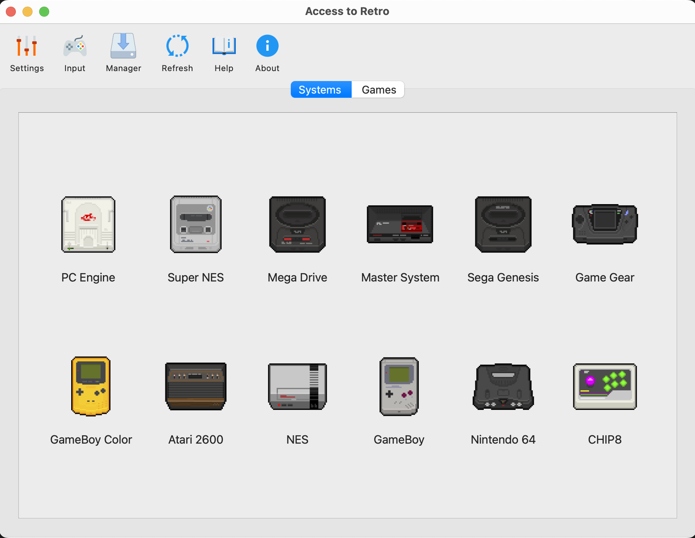
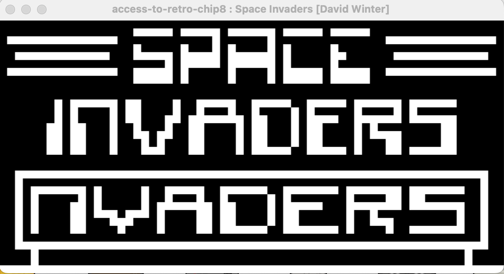

 

  
  <h3 align="center">Access to Retro</h3>
  

    Improving Accessibility of Retro Video Game Emulation
  

  
Table of Contents

  <ol>
    <li>
      <a href="#about-the-project">About The Project</a>
    </li>
    <li><a href="#sub-projects">Sub-projects</a></li>
    <li><a href="#roadmap">Roadmap</a></li>
    <li><a href="#building-and-starting-the-application">Building & Starting The Application</a></li>
    <li><a href="#license">License</a></li>
  </ol>

## About The Project

This project aims to solve a major issue in video game emulation - it's accessibility. Emulation has been with us since the early days of computing and video game console emulation specifically has seen a major increase in popularity recently, however it did not help with the fact that emulation still remains complicatated and confusing to a majority of users.

With Access to Retro simple yet robust and flexible user interface, guidelines it aims to allow a less tech savvy user to enjoy his childhood games while providing powerful tools for emulator developers and community to make everything possible. The project is divided into thre parts:

- Simple yet powerful user facing frontend
- Modern library for emulator developers to integrate their projects with Access to Retro
- Example of an emulator (CHIP8) created using previously mentionted library

The project also includes unit testing framework for C/C++ based projects (virtual consoles or any other projects).

Please see [sub-projects](#sub-projects) for more information about each part.

(<a href="#top">back to the top</a>)

## Sub-projects

### Frontend

Overview:
- Simple to use with clear, user-friendly and platform-native interface
- Written in modern C++
- Uses Qt 6.x for Ui and SDL2 for Graphics
- Cross-platform

The main, user-facing part of the Access to Retro project. It allows users to emulate older video games system with emulators compiled using Access to Retro library, called Virtual Consoles. The user interface was designed to be as simple as possible as the main goal of the project is to improve accessibility by allowing less tech-savyy people to get into video game emulator. Here are some main features of the frontend:

- __Unified Access to Retro Controller Model__: Allows the user to set up his keyboard/gamepad configuration once for all the virtual consoles regardless of what game console they are emulating (for more information please see library description).

- __Game/Virtual Console Manager__: Provides an easy way for the user to install/uninstall games and virtual consoles without the hassle of going through his OS's filesystem.

- __Unified Settings__: There is no need to configure each virtual console/emulator separately, there is only one settings menu that applies to all virtual consoles.

- __Adaptability__: If the user is a beginner they don't have to sit around for hours changing settings, reading guides on how to install games etc like when using other emulator, they can quickly jump into their favourites games, however, the frontend also provides more advanced features for experienced users that want to tailor their experience and get the most out of their games.

### Developer Library

Overview:
- Written using modern C
- Modern, easy to use yet powerful
- Well documented (code documentation + guide)
- High performance with threading

Access to Retro developer library allows emulator developers to port their existing or create new emulator for Access to Retro frontend 
(called _Virtual Consoles_). It allows the developer to focus on actual emulation aspect of the project while abstracting things like: graphics, audio, binary file loading and cross-platform compatibility. Here are some main features that the library provides: 

- __Unified Access to Retro Controller Model__: abstracts gamepad/keyboard input 
for both emulator user and developer by creating a virtual controller that the user can adapt his input device to - this allows the developer to not worry about what kind of device the user is using as all he has to do is provide support for one controller type. 

- __Different Methods of Graphical Output__: Virtual Console developers are free to choose one of the following graphics modes: __Raw Framebuffer__, __SDL2 Graphics Library__, __OpenGL__. They are the most used methods that emulators use which means that most existing emulators can easily be ported to Access to Retro.  It provides flexibility for developers to choose the method they are most experienced with. By providing __SDL2 Graphics Library__ as one of the methods it allows  for any other graphical API such as __Vulkan__ or __DirectX__ to be used and there is also native support planned for both.

- __Threading__: The library and the frontend is structured in a way so that the developer does not have to worry about threading. All the developer has to do is to provide a framerate at which the emulator runs and define a seperate function for main, render and input threads, they will be timed according to the frame rate with no input needed from the developer.

- __Helpers & Cross-platform compatibility__: Access to Retro library also provides a variety of structures and functions that help with most common
problems when programming an emulator, it also helps with cross-platform compatibility ensuring that developers can provide their virtual consoles for variety of 
platforms and users.

### CHIP8 Emulator

Overview:
- Fully functional emulator of CHIP8
- Written using modern C++
- Uses Access to Retro developer library to showcase all the features

This emulator is provided as an example on how to use the developer library to create Virtual Consoles for Access to Retro Frontend. It emulates an old CHIP8 interpreter. While CHIP8 is technically not an actual hardware but an interpreter written for COSMAC VIP Computers however it is designed in a way that resembles it and is a great way to demonstrate how emulation works without complexity of more advanced systems such as GameBoy. It fully utilisies Access to Retro library, using __SDL2 Graphics Library__ as its graphical output source and uses other features such as __Unified Access to Retro Controller Model__.

(<a href="#top">back to the top</a>)

## Roadmap

- 0.1:
  - [x] Frontend prototype implemented
- 0.2:
  - [x] Library prototype implemented
    - [x] Graphics
    - [x] Input
    - [x] Other helpers
  - [x] CHIP8 Virtual Console implemented
    - [x] Full Instruction Set
    - [x] Graphics
    - [x] Input
- Initial Release (1.0):
  - [X] Full cross-platform support (Windows, macOS, Linux)
    - [X] Windows
    - [x] macOS
    - [x] Linux
  - [x] Unit testing framework
  - [x] Frontend initial release finalised
  - [x] Library initial release finalised
  - [x] Documentation for initial release finalised
- Future Possible Releases:
  - [ ] Multiple graphical API helpers (Vulkan, DirectX)
  - [ ] Full audio support in the library
  - [ ] Custom, developer defined, settings for Virtual Consoles

(<a href="#top">back to the top</a>)

## Building and Starting The Application

Please see [Building Guide](https://github.com/ElusiveParrot/access-to-retro/blob/master/documentation/Building-Access-to-Retro.pdf).

(<a href="#top">back to the top</a>)

## License

Please see [LICENSE](https://github.com/ElusiveParrot/access-to-retro/blob/master/LICENSE).

(<a href="#top">back to the top</a>)

